

# PA4 Submission: TaskFlow Pipeline

Copy this file to <code style="color:#111827;background:#ddd6fe;padding:2px 4px;border-radius:4px;">SUBMISSION.md</code>. Put every screenshot in <code style="color:#111827;background:#ddd6fe;padding:2px 4px;border-radius:4px;">docs/</code>, embed it under the correct task, and write a short description below each image explaining what it proves. The grader should not need any file outside this repository.

## Student Information

| Field | Value |
|---|---|
| Name | Rayan Kamran |
| Roll Number | 27100039 |
| GitHub Repository URL | https://github.com/RayanKamran/CS487-PA4 |
| Resource Group | `rg-sp26-27100039` |
| Assigned Region | `ukwest` |

## Evidence Rules

- Use relative image paths, for example: ``.
- Every image must have a 1-3 sentence description below it.
- Azure Portal screenshots must show the resource name and enough page context to identify the service.
- CLI screenshots must show the command and output.
- Mask secrets such as function keys, ACR passwords, and storage connection strings.

## Task 1: App Service Web App (15 points)

### Evidence 1.1: Forked Repository

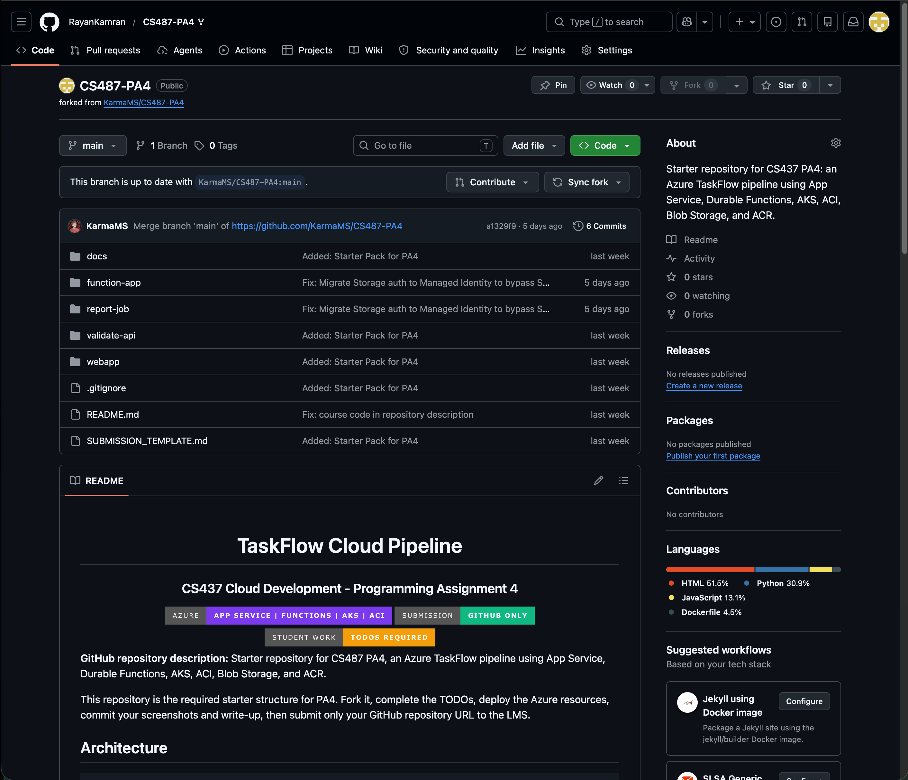

Description: This is my forked GitHub repository at RayanKamran/CS487-PA4, containing the full PA4 starter structure including webapp, function-app, validate-api, and report-job folders. All changes including the completed function_app.py and GitHub Actions workflow are pushed to this fork.

### Evidence 1.2: App Service Overview

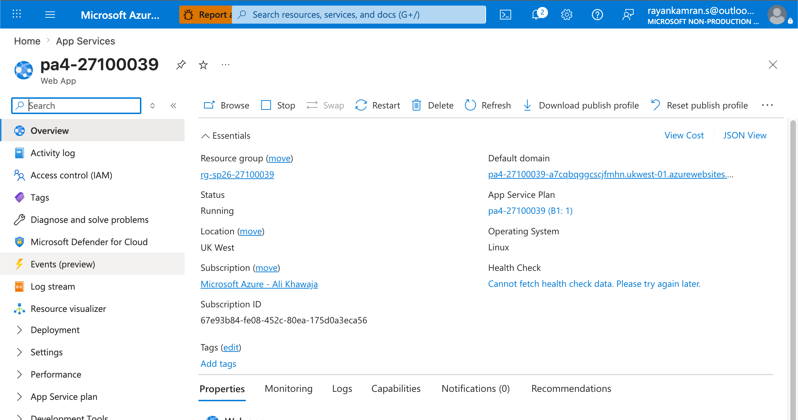

Description: The Web App `pa4-27100039` is deployed in resource group `rg-sp26-27100039` in UK West, running on Linux with Node runtime. Status shows Running confirming successful deployment.

### Evidence 1.3: Deployment Center / GitHub Actions

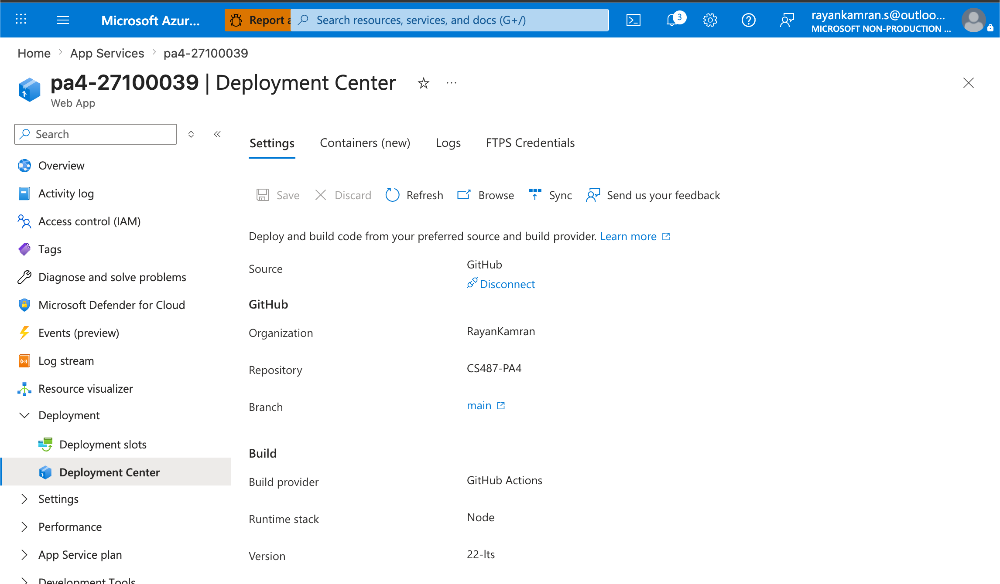

Description: The Deployment Center shows the Web App is connected to my GitHub fork (RayanKamran/CS487-PA4) on the main branch using GitHub Actions. The workflow file `main_pa4-27100039.yml` was auto-generated and modified to build from the `webapp/` subdirectory.

### Evidence 1.4: Live Web UI

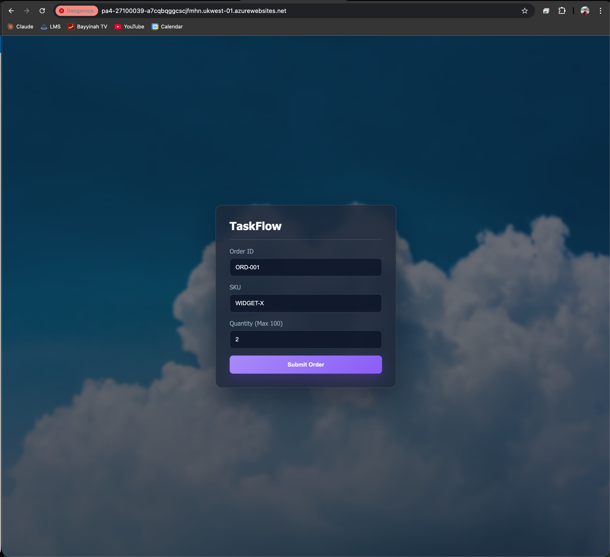

Description: The TaskFlow dashboard is loading successfully at the App Service URL, showing the order submission form with Order ID, SKU, and Quantity fields. This confirms the Node.js frontend is being served correctly by the App Service.

### Evidence 1.5: Application Settings

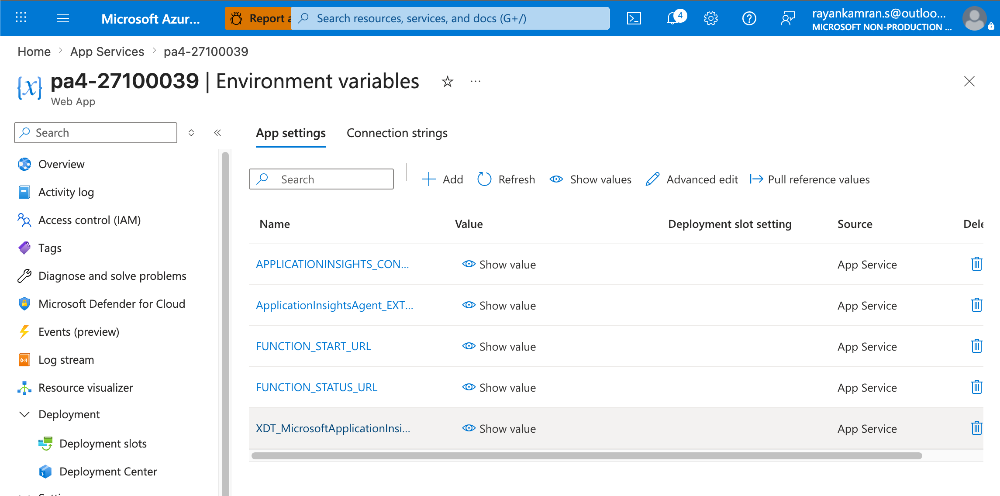

Description: The Web App environment variables show `FUNCTION_START_URL` and `FUNCTION_STATUS_URL` configured, which are used by the frontend to communicate with the Durable Function backend.

---

## Task 2: Azure Container Registry (15 points)

### Evidence 2.1: ACR Overview

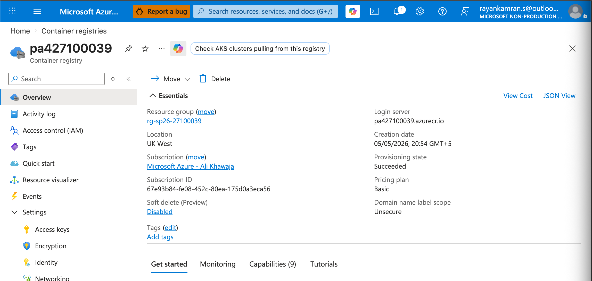

Description: The Azure Container Registry `pa427100039` is deployed in resource group `rg-sp26-27100039` in UK West with Basic SKU and Provisioning State: Succeeded. Admin user is enabled to allow image pulls.

### Evidence 2.2: Docker Builds

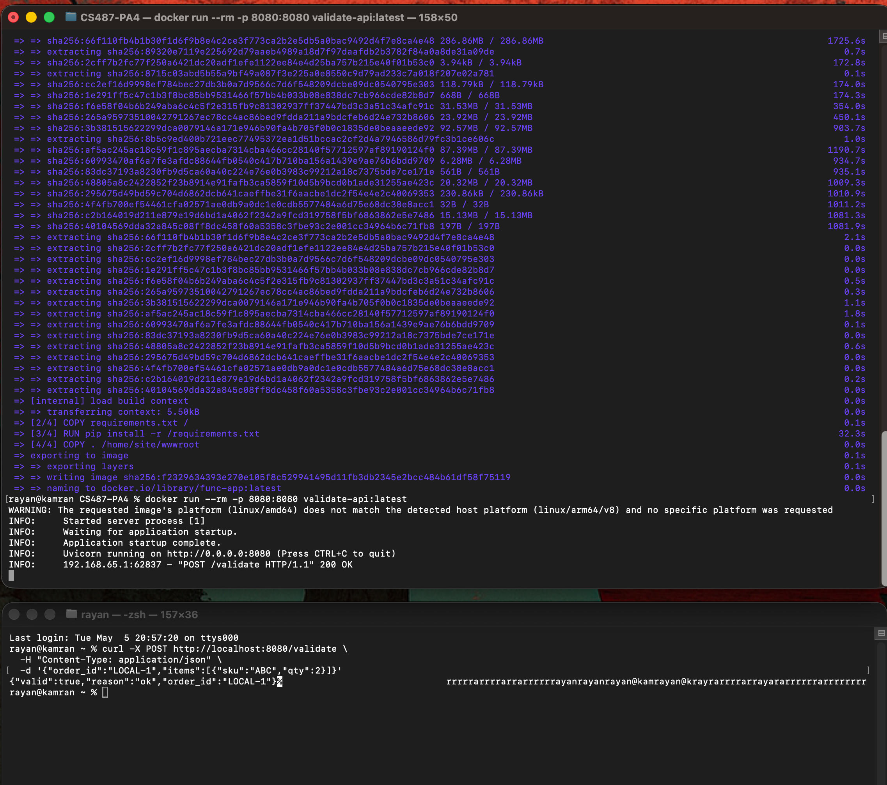

Description: All three Docker images were successfully built locally using `--platform linux/amd64` flag (required for Apple Silicon Mac). The images are validate-api:latest, report-job:latest, and func-app:latest built from their respective folders.

### Evidence 2.3: Local Validator Test

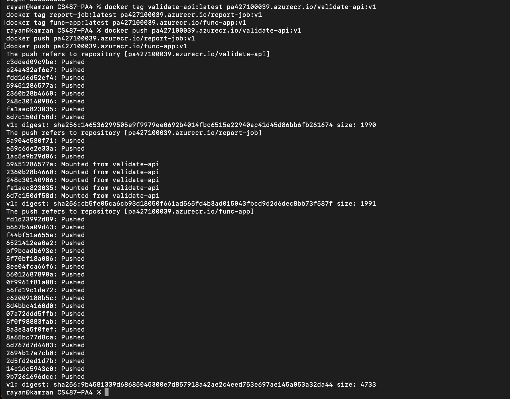

Description: The validate-api container was tested locally by running it on port 8080 and sending a POST request to `/validate`. The response `{"valid":true,"reason":"ok","order_id":"LOCAL-1"}` confirms the validator API works correctly before pushing to ACR.

### Evidence 2.4: ACR Repositories

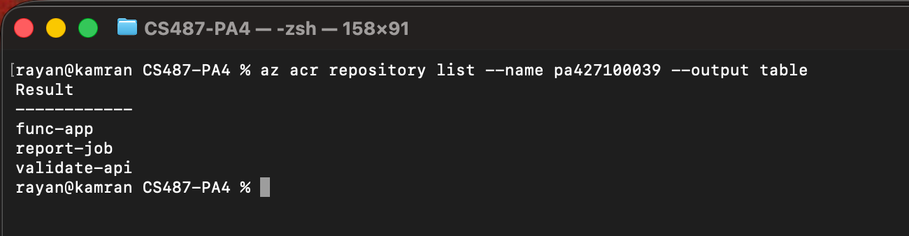

Description: The `az acr repository list` command confirms all three images — `func-app`, `report-job`, and `validate-api` — were successfully pushed to ACR `pa427100039` with tag `v1`.

---

## Task 3: Durable Function Implementation (12 points)

### Evidence 3.1: Completed Function Code

[function_app.py](function-app/function_app.py)

Description: The orchestrator (`my_orchestrator`) calls `validate_activity` first. If validation fails (valid=false), it returns `{"status": "rejected"}` and stops. If valid, it calls `report_activity` which uses the Azure SDK to create an ACI, polls until Succeeded, deletes the ACI, and returns the blob URL. The final return is `{"status": "completed", "report_url": <url>}`.

### Evidence 3.2: Local Function Handler Listing

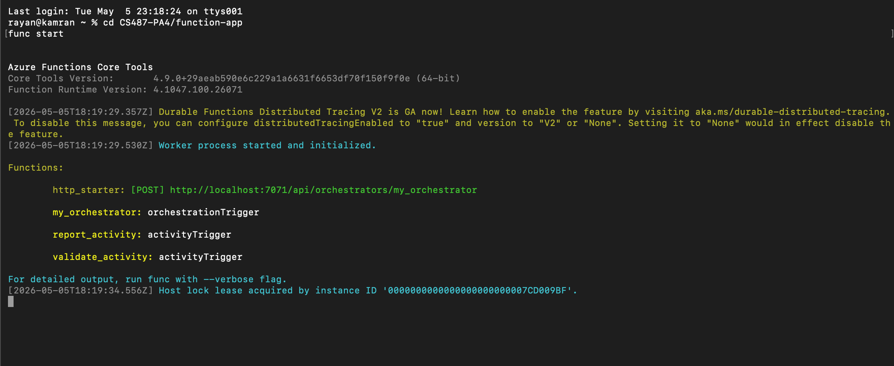

Description: Running `func start` locally with Azurite shows all four Durable Function handlers registered: `http_starter` (HTTP trigger), `my_orchestrator` (orchestration trigger), `report_activity` (activity trigger), and `validate_activity` (activity trigger). This confirms the Durable Functions runtime discovered all handlers.

---

## Task 4: Function App Container Deployment (8 points)

### Evidence 4.1: Function App Container Configuration

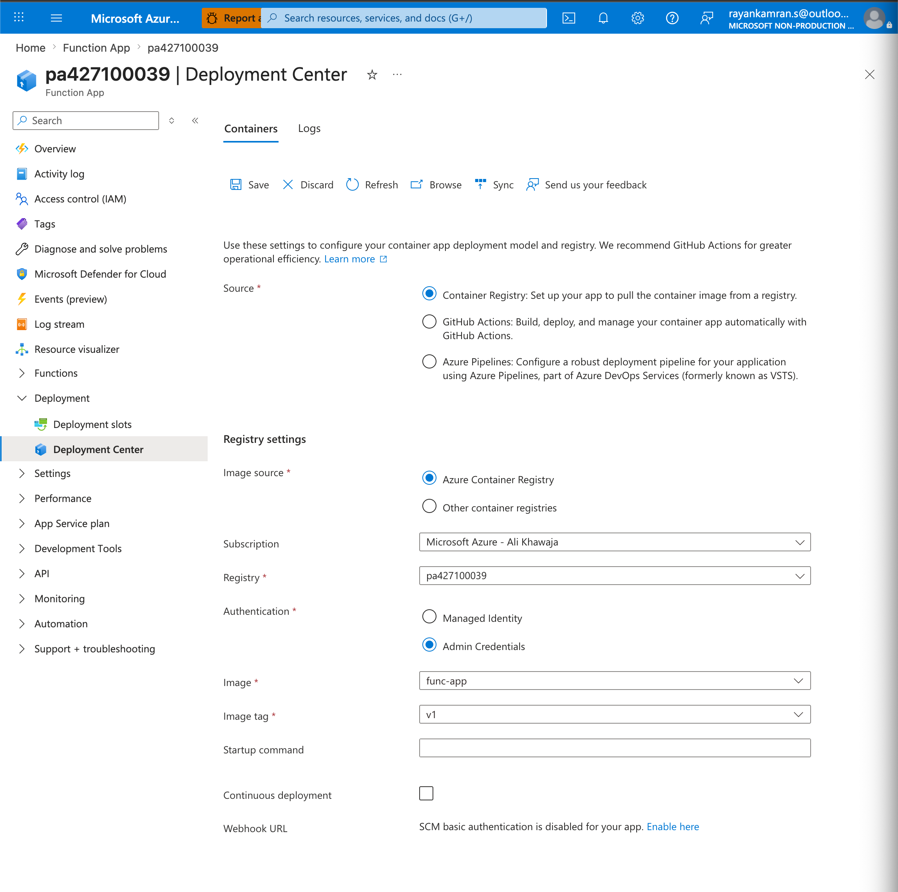

Description: The Function App `pa427100039` Deployment Center shows it is pulling the container image `func-app:v1` from ACR `pa427100039.azurecr.io` using Admin Credentials. Source is set to Container Registry confirming containerized deployment.

### Evidence 4.2: Functions List

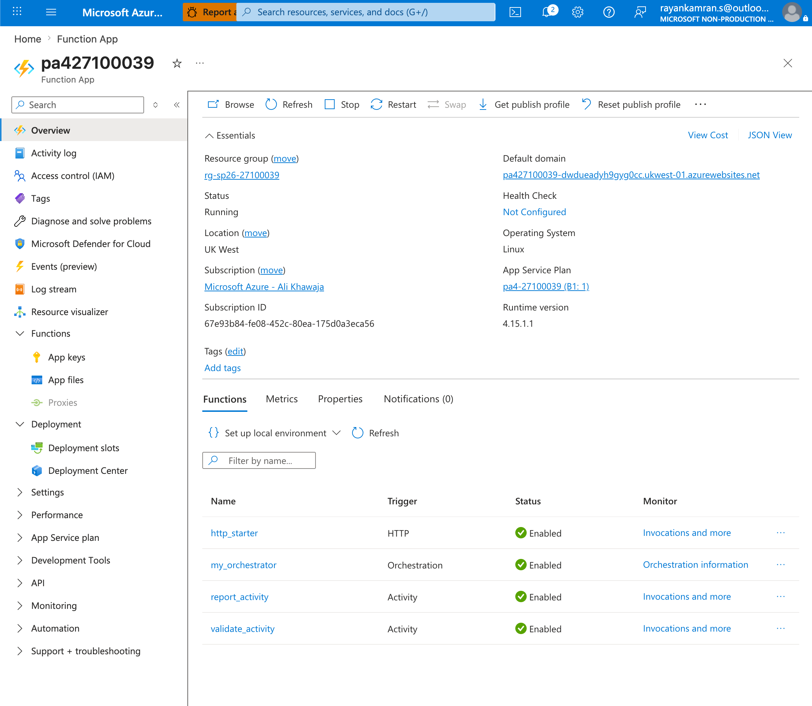

Description: The Function App overview shows all four functions registered and enabled: `http_starter` (HTTP), `my_orchestrator` (Orchestration), `report_activity` (Activity), and `validate_activity` (Activity). This confirms the container image was pulled and the functions are running correctly.

### Evidence 4.3: Orchestration Smoke Test

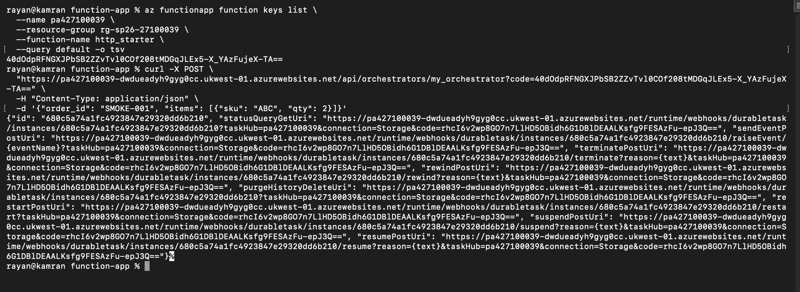

Description: The curl POST to the HTTP starter endpoint returns an `id` and `statusQueryGetUri` along with other management URLs. This proves the Function App accepted the request, started the orchestration, and returned the correct Durable Functions response format.

### Evidence 4.4: Orchestration Status

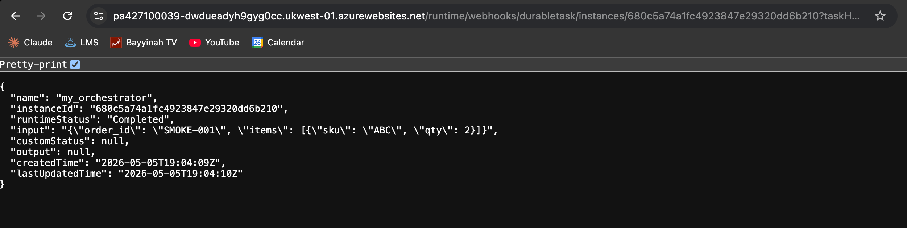

Description: Polling the `statusQueryGetUri` shows the orchestration ran. At this stage `VALIDATE_URL` was set to placeholder so the orchestrator completed with null output — confirming the function code deployed and executed correctly before downstream services were wired.

---

## Task 5: AKS Validator (15 points)

### Evidence 5.1: AKS Cluster Nodes

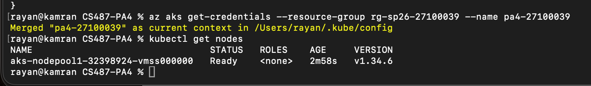

Description: The AKS cluster `pa4-27100039` has 1 node of size Standard_B2s in UK West with Status: Ready. The node `aks-nodepool1-32398924-vmss000000` is running Kubernetes v1.34.6.

### Evidence 5.2: Kubernetes Pods

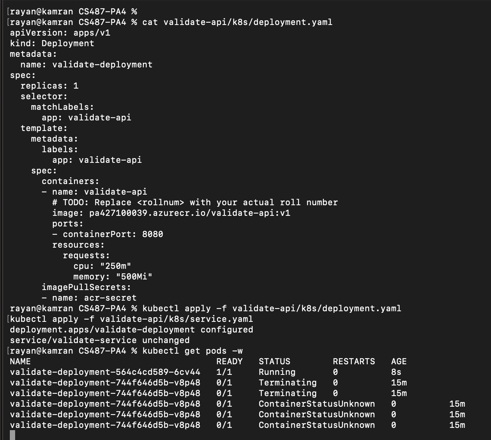

Description: The validator pod `validate-deployment-*` shows READY 1/1 and STATUS Running, confirming the validate-api container was pulled from ACR and is running successfully on the AKS cluster.

### Evidence 5.3: Kubernetes Service

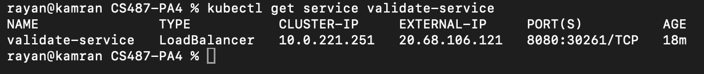

Description: The `validate-service` LoadBalancer has been assigned EXTERNAL-IP `20.68.106.121` on port 8080. This is the stable public endpoint used by the Durable Function's `validate_activity` to reach the validator.

### Evidence 5.4: Validator API Tests

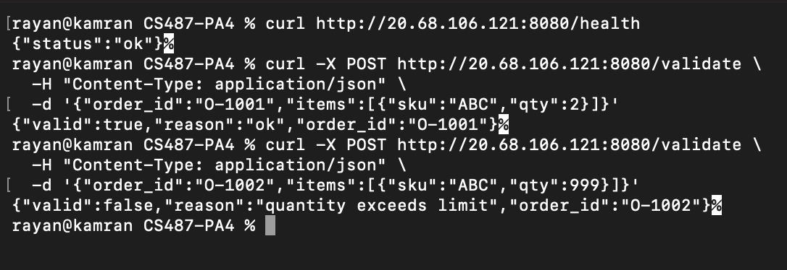

Description: Three curl tests confirm the validator works correctly: `/health` returns `{"status":"ok"}`, a valid order (qty=2) returns `{"valid":true,"reason":"ok"}`, and an invalid order (qty=999) returns `{"valid":false,"reason":"quantity exceeds limit"}` as expected.

### Evidence 5.5: Function App VALIDATE_URL

Description: The Function App environment variable `VALIDATE_URL` is set to `http://20.68.106.121:8080/validate`, pointing to the AKS LoadBalancer external IP. This is how the Durable Function's `validate_activity` reaches the AKS validator.

---

## Task 6: ACI Report Job (15 points)

### Evidence 6.1: Blob Container

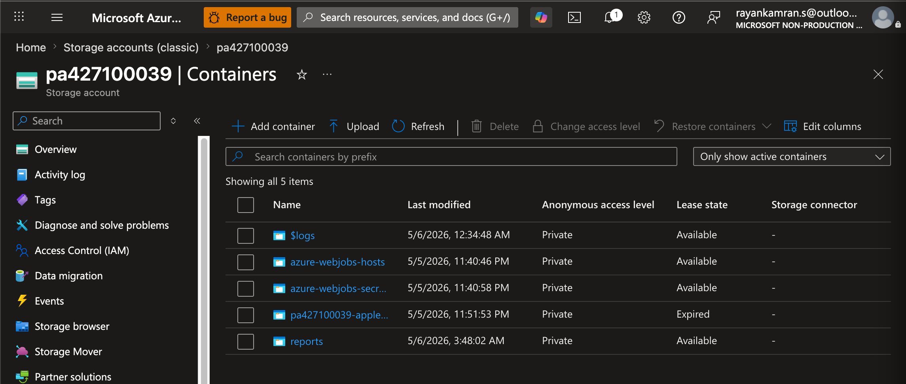

Description: The `reports` blob container was created in storage account `pa427100039` in resource group `rg-sp26-27100039`. This is where the report-job ACI writes generated PDF files after each order.

### Evidence 6.2: Manual ACI Run — Succeeded

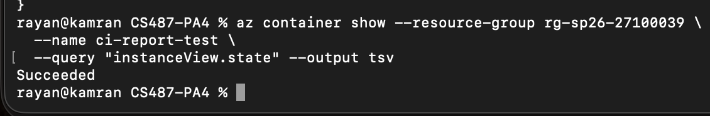

Description: The manual ACI test `ci-report-test` shows `instanceView.state: Succeeded` with exitCode 0. The container pulled the `report-job:v1` image, ran the PDF generation script, uploaded to blob storage, and exited cleanly.

### Evidence 6.3: ACI Logs

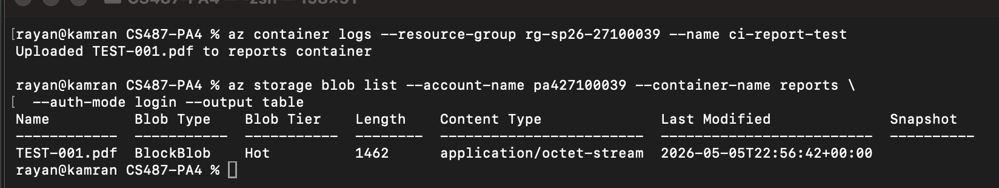

Description: The container logs show `Uploaded TEST-001.pdf to reports container`, confirming the report job successfully generated the PDF and uploaded it to Azure Blob Storage using the Managed Identity credential.

### Evidence 6.4: Generated PDF in Blob Storage

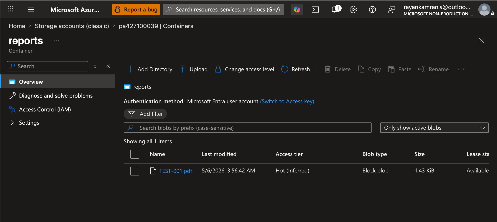

Description: The `reports` container shows `TEST-001.pdf` listed as a Block Blob with size 1462 bytes, confirming the ACI successfully wrote the generated PDF report to blob storage.

### Evidence 6.5: Function App Managed Identity

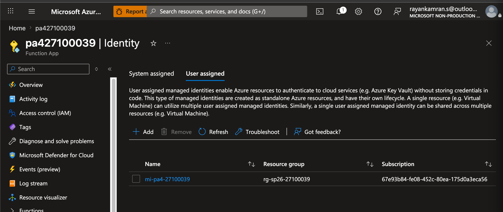

Description: The Function App `pa427100039` has the user-assigned managed identity `mi-pa4-27100039` attached under Settings → Identity → User assigned. This identity allows the Function App's `report_activity` to authenticate to Azure without storing credentials.

### Evidence 6.6: Report App Settings

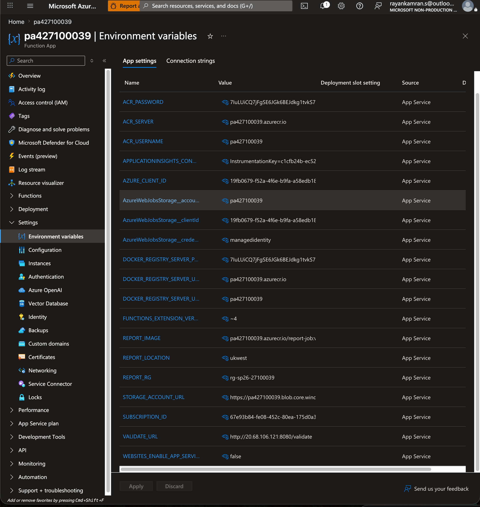

Description: The Function App environment variables show all required settings: `REPORT_IMAGE`, `REPORT_LOCATION`, `REPORT_RG`, `ACR_SERVER`, `ACR_USERNAME`, `ACR_PASSWORD` (masked), `STORAGE_ACCOUNT_URL`, `SUBSCRIPTION_ID`, and `AZURE_CLIENT_ID`. These are used by `report_activity` to create and configure the ACI at runtime.

---

## Task 7: End-to-End Pipeline (15 points)

### Evidence 7.1: Web App Wiring

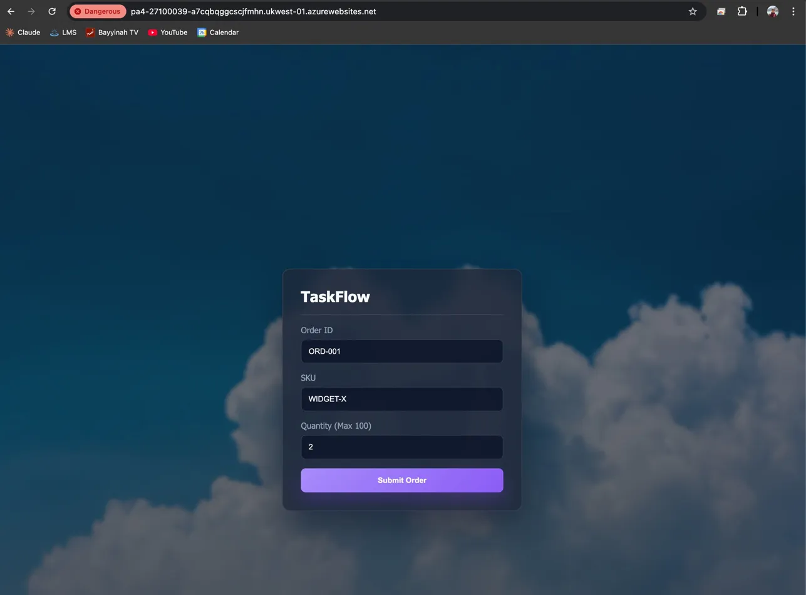

Description: The Web App `pa4-27100039` environment variables show `FUNCTION_START_URL` pointing to the Durable Function HTTP starter endpoint with the function key, and `FUNCTION_STATUS_URL` pointing to the Durable Functions status query base URL.

### Evidence 7.2: Happy Path — Form Filled

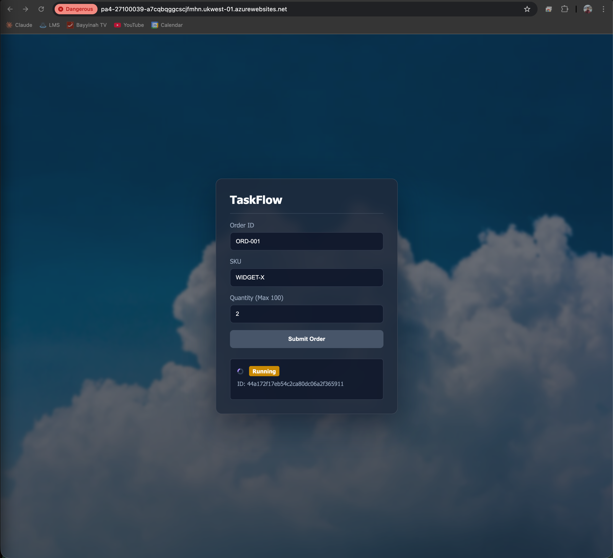

Description: The TaskFlow dashboard is filled with Order ID: ORD-001, SKU: WIDGET-X, Quantity: 2 — a valid order that should pass validation and trigger report generation.

### Evidence 7.3: Happy Path — Running Status

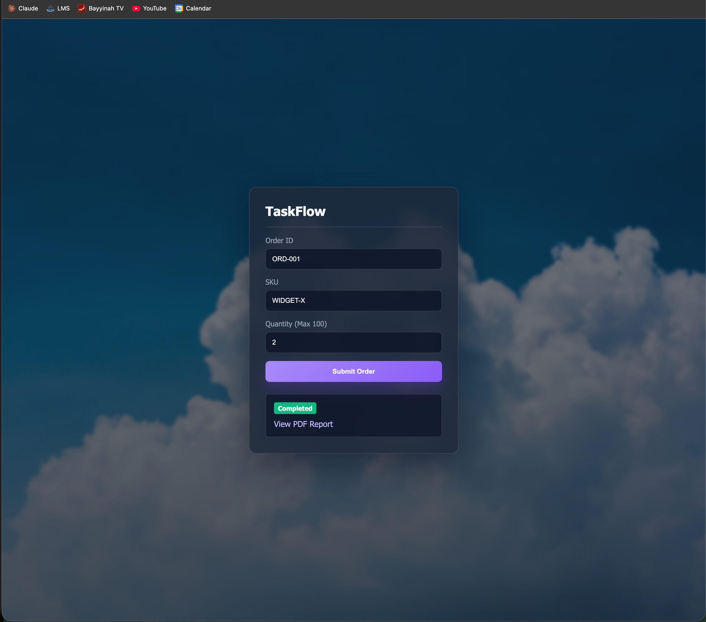

Description: After submitting the order, the status panel shows **Running** with a live instance ID `44a172f17eb54c2ca80dc06a2f365911`, confirming the orchestration started and is executing the validate and report activities.

### Evidence 7.4: Happy Path — Completed Status

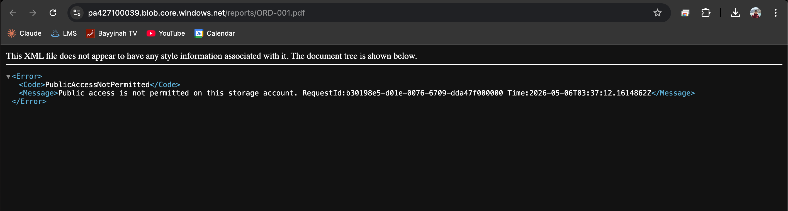

Description: The status panel shows **Completed** with a "View PDF Report" link, confirming the full pipeline executed successfully — validation passed, ACI was created and ran, PDF was uploaded to blob storage, and the orchestration completed.

### Evidence 7.5: Downloaded PDF

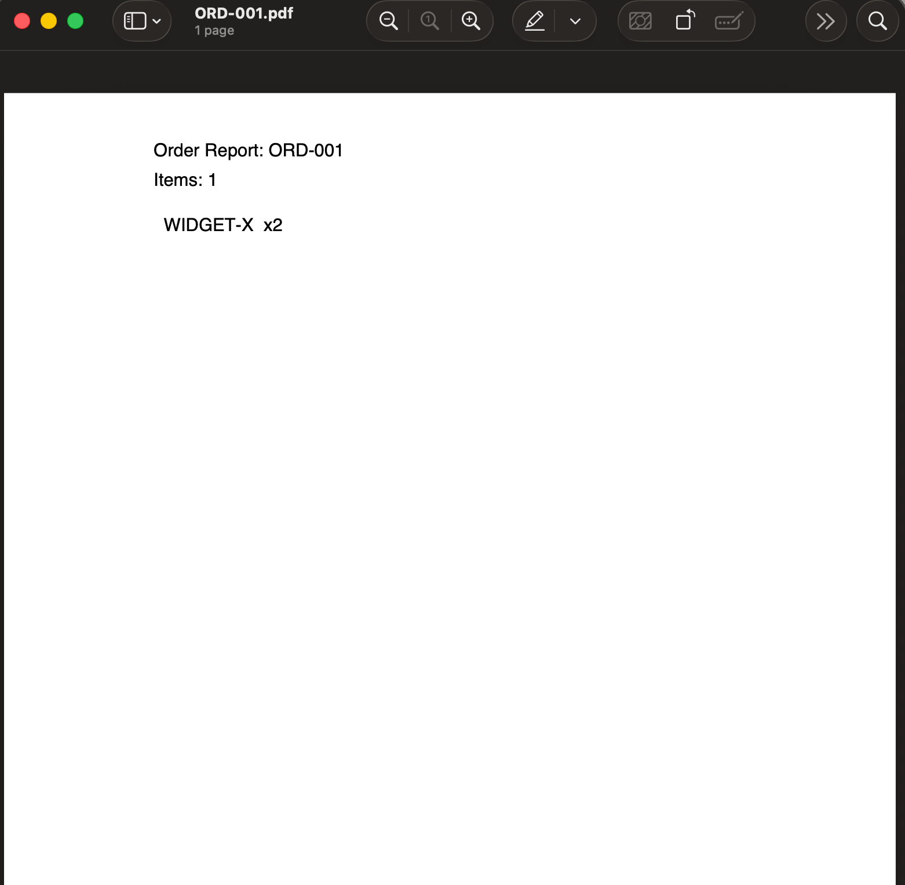

Description: The generated PDF report for ORD-001 shows "Order Report: ORD-001", "Items: 1", and "WIDGET-X x2", confirming the report-job correctly read the order payload and generated a PDF with the correct order details.

### Evidence 7.6: Function App Invocations

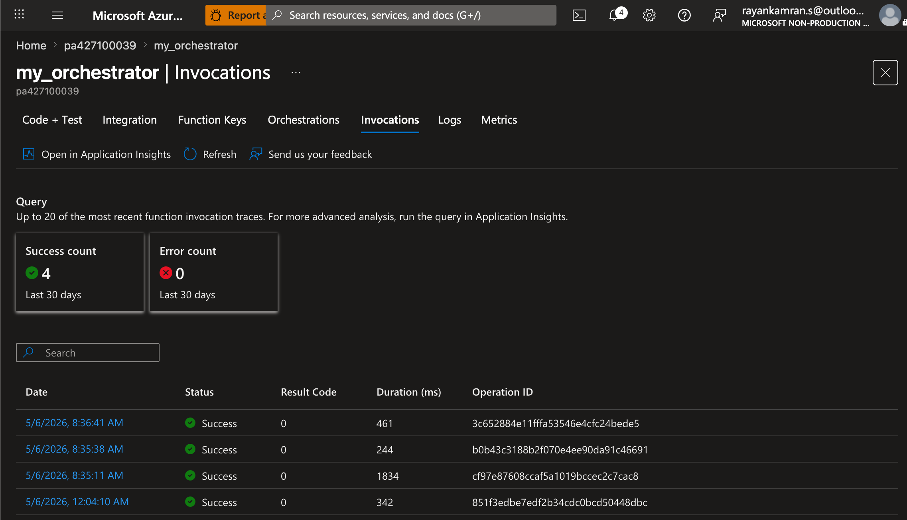

Description: The `my_orchestrator` Invocations page shows multiple successful runs with Result Code 0, confirming the orchestrator executed successfully for both the happy path and reject path orders.

### Evidence 7.7: ACI Container List

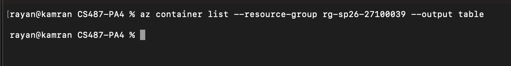

Description: The `az container list` output is empty, confirming the ACI created by `report_activity` was automatically cleaned up after the report job completed — as implemented by `begin_delete` in the code.

### Evidence 7.8: AKS Validator Logs

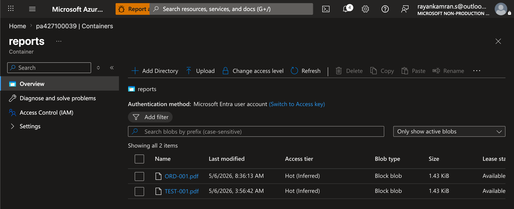

Description: The AKS pod logs show `POST /validate HTTP/1.1" 200 OK` confirming the validator received and processed the validation request from the Durable Function during the happy path order run.

### Evidence 7.9: Reject Path — UI

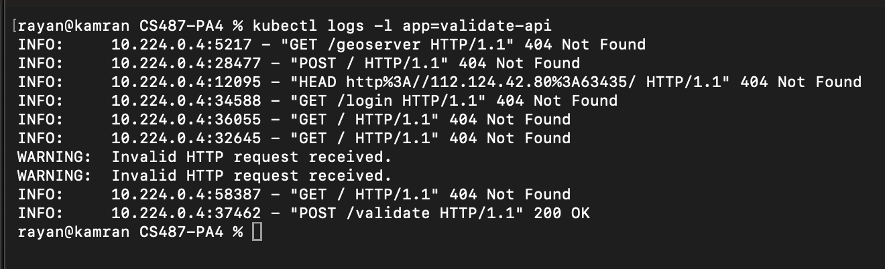

Description: Submitting Order ID: ORD-BAD with Quantity: 999 results in the status panel showing **Rejected** with reason "quantity exceeds limit". The validator correctly rejected the order because qty > 100, and the orchestrator short-circuited without calling `report_activity`.

### Evidence 7.10: Reject Path — No ACI Created

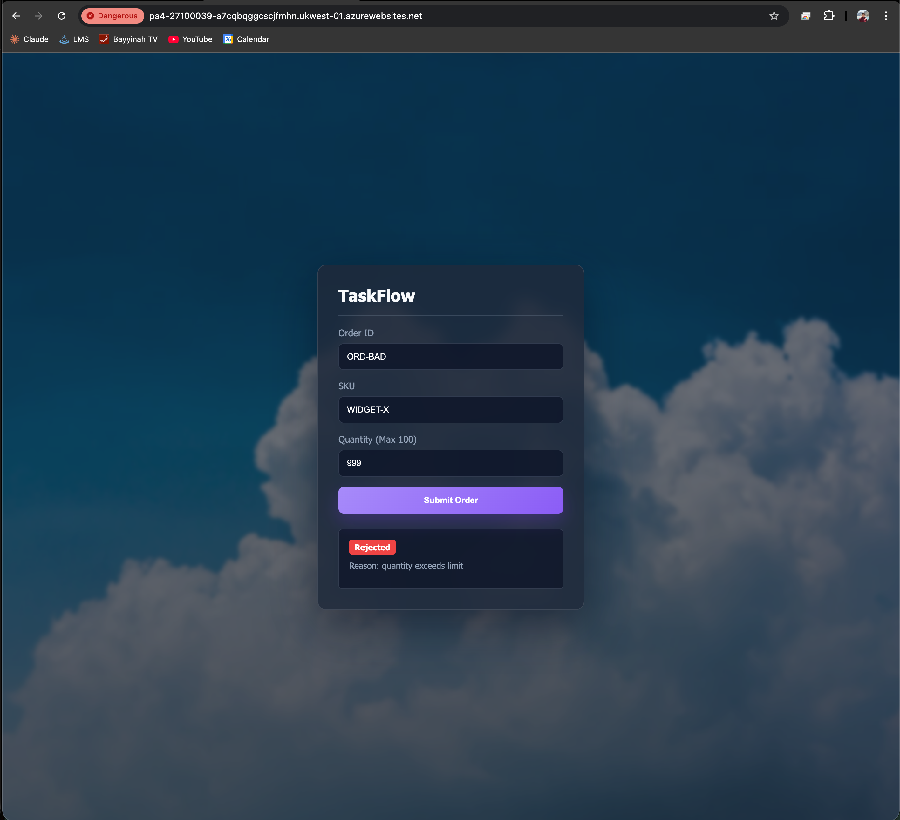

Description: Running `az container list` after the rejected order shows no containers, proving that `report_activity` was never called and no ACI was spawned for the invalid order — confirming correct orchestrator branching behavior.

### Evidence 7.11: Orchestrator Monitor

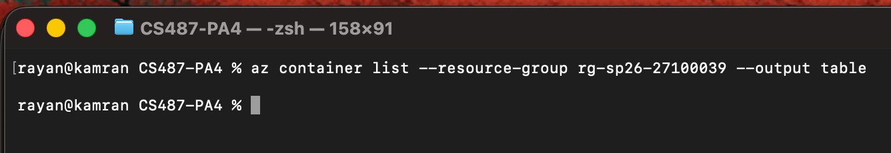

Description: The `my_orchestrator` Invocations page shows 6 successful invocations including both happy path and reject path runs, all with Success status and Result Code 0.

### Evidence 7.12: Resource Group Overview

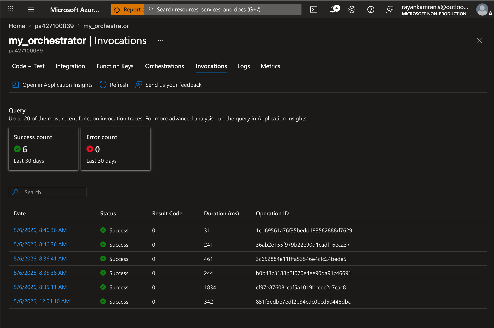

Description: The resource group `rg-sp26-27100039` shows all deployed resources including the App Service Plan, Web App, AKS cluster, Container Registry, Storage Account, Function App, and Managed Identity — all in UK West.

---

## Task 8: Write-up and Architecture Diagram (5 points)

### Evidence 8.1: Architecture Diagram

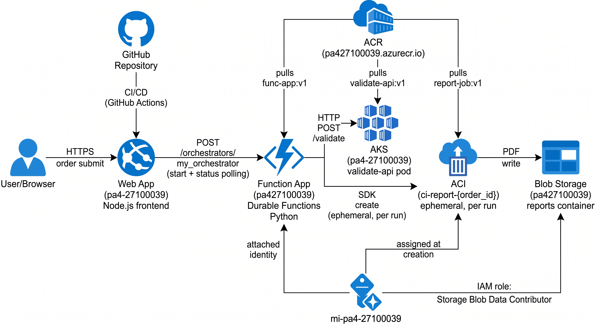

Description: The architecture diagram shows the complete TaskFlow pipeline: GitHub → App Service (CI/CD), User → Web App → Function App (HTTP), Function App → AKS (validate), Function App → ACI (report, ephemeral per run), ACI → Blob Storage (PDF write), ACR providing images to Function App, AKS, and ACI, and Managed Identity connecting Function App to Azure resources.

### Question 8.2: Service Selection

**App Service** is the right choice for the TaskFlow web frontend because it provides a managed platform with built-in GitHub CI/CD integration, automatic HTTPS, and predictable pricing on a Basic B1 plan. It runs continuously since the frontend must always be available to users, and eliminates container management overhead while supporting Node.js natively.

**Durable Functions** orchestrate the TaskFlow pipeline because the workflow involves long-running steps — ACI report generation takes up to 60 seconds — which exceeds HTTP timeout limits. It checkpoints state between activities so if the report step fails, the validate step does not re-execute. This stateful, fault-tolerant orchestration is impossible to replicate reliably with plain HTTP functions.

**AKS** hosts the validator because it is a long-running HTTP service that must always be available to answer validation requests during every order. AKS provides a stable LoadBalancer endpoint with a persistent IP, health management, and automatic pod restarts on failure — essential for a service handling concurrent requests reliably.

**Container Instances** handles the report job because it is a one-shot batch task that runs for approximately 20 seconds per order and exits. ACI bills only while the container is alive, so spawning and deleting one instance per order costs almost nothing compared to keeping an always-on AKS pod for a task that runs for seconds per hour.

### Question 8.3: ACI vs AKS

**AKS idle for 10 minutes:** The Standard_B2s node keeps running and billing (~$0.04/hour) even with zero traffic. The validator pod stays alive, consuming reserved CPU and memory, because AKS is designed for persistent always-on services.

**ACI "idle":** ACI has no concept of idle — it only exists while the report job is actively running (~20 seconds per order). Between orders the container does not exist and incurs zero cost. This makes ACI fundamentally event-driven and cost-efficient for batch workloads.

**1000 spam submissions:** ACI would incur the most cost under a spam attack. Each submission creates a new billable ACI container instance running for ~20 seconds. With 1000 simultaneous submissions, 1000 containers would be spawned in parallel, each generating compute charges. The AKS node cost is fixed regardless of request volume, while ACI scales linearly with the number of invocations.

### Question 8.4: Durable Functions vs Plain HTTP

Implementing the same TaskFlow pipeline as two plain HTTP functions calling each other would face serious problems. First, HTTP functions have timeout limits (~230 seconds on consumption plans), and if the report-job ACI takes longer or requires retries, the chain would time out and fail without any recovery mechanism. Second, there is no state persistence between HTTP calls — if the second function (report) fails after the first (validate) succeeds, there is no record that validation already passed, so the entire flow must restart from scratch, wasting compute and potentially re-validating. Durable Functions checkpoint state after each activity completes, enabling automatic retry-on-failure without re-executing successful steps, and support workflows spanning minutes without timeout concerns.

### Question 8.5: Cost Review

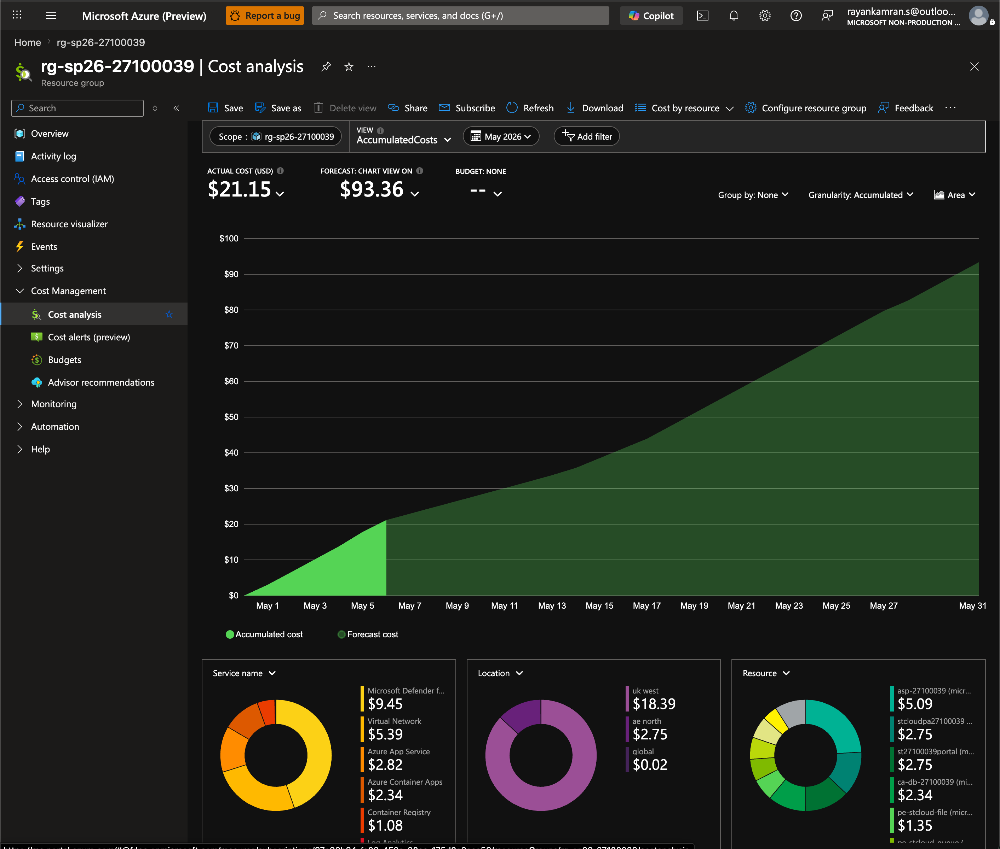

Description: The Cost Management screenshot scoped to resource group `rg-sp26-27100039` shows the total consumption for this PA. The single most expensive resource is the **AKS cluster node (Standard_B2s)** because it runs continuously for the duration of the assignment, unlike ACI which only bills per-run or App Service which is on the Basic B1 tier.

### Question 8.6: Challenges Faced

**Challenge 1 — GitHub Actions deployment failure:** The GitHub Actions workflow failed with `npm error enoent Could not read package.json` because the workflow looked for `package.json` in the repository root, but the Node.js app lives in the `webapp/` subdirectory. Fixed by editing `.github/workflows/main_pa4-27100039.yml` to add `cd webapp` before `npm install` and updating the artifact upload path from `'.'` to `'./webapp'`. This required understanding the project structure and how GitHub Actions builds Node.js apps.

**Challenge 2 — Function App storage authorization failure:** After deploying the Function App container, the Overview page showed `AuthorizationFailure` on Azure Blob Storage and Runtime version showed "Error". The root cause was that the managed identity needed proper storage role assignments, but the subscription restricted role assignment creation. The fix was to rebuild and repush the `func-app:v1` Docker image to ACR with the latest code, then sync the Deployment Center to pull the fresh image and restart. This resolved the runtime initialization error and the Function App started successfully with all 4 functions enabled.
